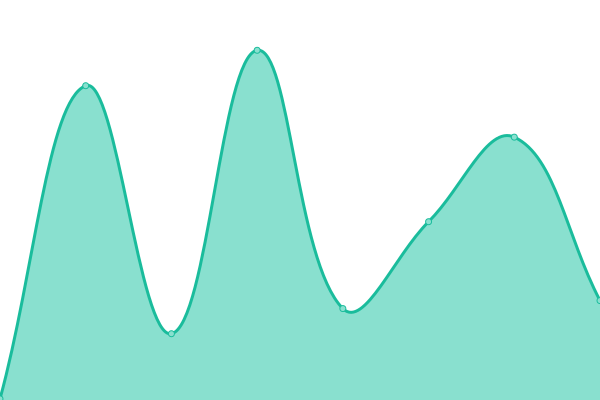
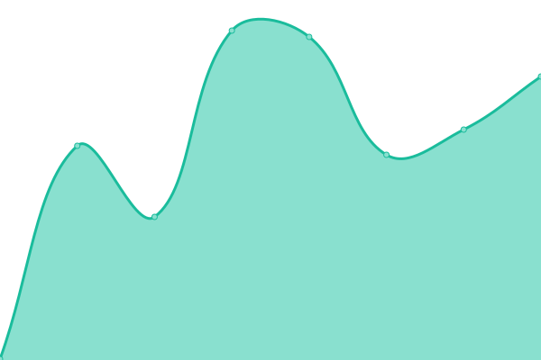

# [Live Status](https://demo.upptime.js.org): <!--live status--> **🟩 All systems operational**

This repository contains the open-source uptime monitor and status page for [Oula Health](https://demo.upptime.js.org), powered by [Upptime](https://github.com/upptime/upptime).

<!--start: status pages-->
<!-- This summary is generated by Upptime (https://github.com/upptime/upptime) -->
<!-- Do not edit this manually, your changes will be overwritten -->
<!-- prettier-ignore -->
| URL | Status | History | Response Time | Uptime |
| --- | ------ | ------- | ------------- | ------ |
|  [Oula Main Site](https://oulahealth.com) | 🟩 Up | [oula-main-site.yml](https://github.com/oula-health/status/commits/HEAD/history/oula-main-site.yml) | 

 267ms
     
 | 

<a href="https://status.oulahealth.com/history/oula-main-site">100.00%</a>
    

|  [Oula Patient Portal](https://my.oulahealth.com) | 🟩 Up | [oula-patient-portal.yml](https://github.com/oula-health/status/commits/HEAD/history/oula-patient-portal.yml) | 

 215ms
     
 | 

<a href="https://status.oulahealth.com/history/oula-patient-portal">100.00%</a>
    

|  Oula API v1 | 🟩 Up | [oula-api-v1.yml](https://github.com/oula-health/status/commits/HEAD/history/oula-api-v1.yml) | 

 195ms
     
 | 

<a href="https://status.oulahealth.com/history/oula-api-v1">100.00%</a>
    

|  Oula API v2 | 🟩 Up | [oula-api-v2.yml](https://github.com/oula-health/status/commits/HEAD/history/oula-api-v2.yml) | 

 310ms
     
 | 

<a href="https://status.oulahealth.com/history/oula-api-v2">100.00%</a>
    

<!--end: status pages-->

[**Visit our status website →**](https://status.oulahealth.com)

## License

- Powered by: [Upptime](https://github.com/upptime/upptime)
- Code: [MIT](./LICENSE) © [Anand Chowdhary](https://anandchowdhary.com), supported by [Pabio](https://pabio.com)
- Data in the `./history` directory: [Open Database License](https://opendatacommons.org/licenses/odbl/1-0/)
